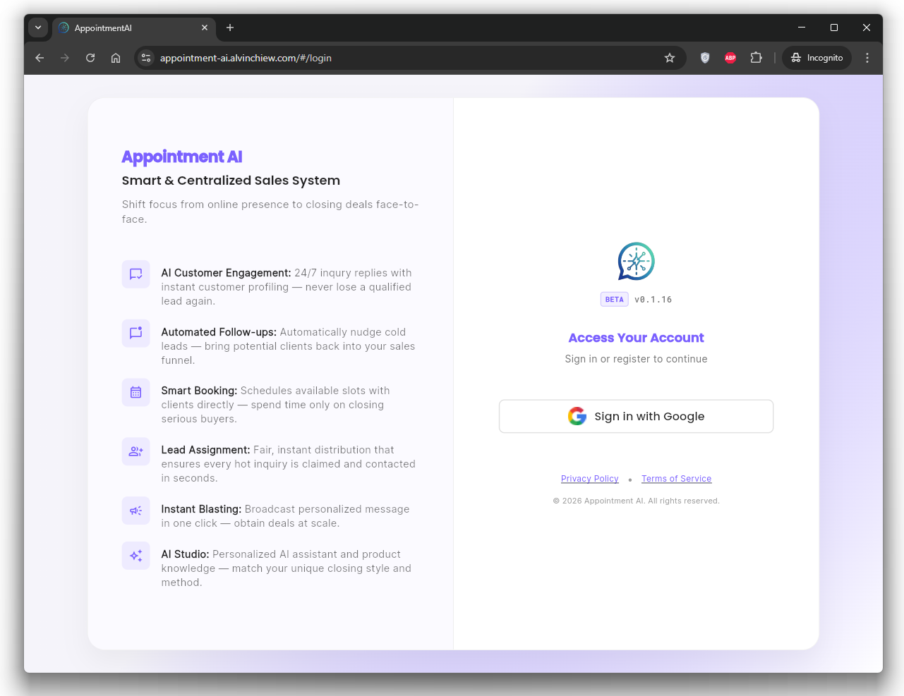
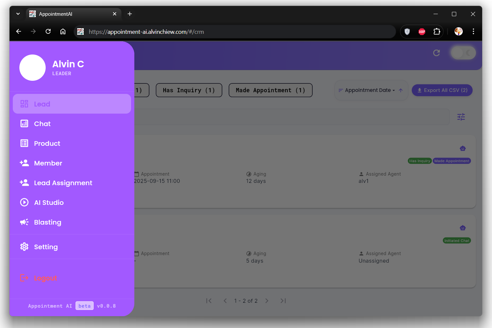
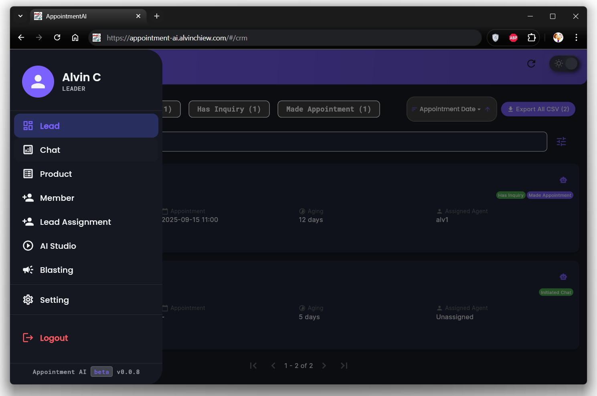

# Appointment AI

Link: [click me](https://appointment-ai.alvinchiew.com/)

## Overview

A smart & centralized system for sales leaders and agencies — automates routine tasks and enabling data-driven decisions — shifts focus from online presence to closing deals face-to-face.

Currently handles WhatsApp inquiries, customer follow up, appointment scheduling and lead assignment using LLM AI agent, RAG system and MCP servers. Comes with a full suite of CRM web app for leads, product knowledge base, and sales automation configurations. Operates in enterprise production grade with zero down time, automated integration and deployment (CI/CD) with GitOps, and infrastructure as code (IaaS)

## Features

1. **AI WhatsApp Customer Engagement**
   - Product question (text, voice) and answer (text, document, audio, video)
   - AI Customer-Product matching via RAG system
   - Automated follow-up
   - Appointment Scheduling
   - **[ON-DEMAND]** Product Order Handling (Order Placement, Receipt Submission) - Use form instead
   - Form submission
   - Multiple bots setup
   - **[FUTURE]** AI spam handling (human/bot)
1. **AI Leads Management**
   - Lead information, e.g. customer, chat, appointment, sales representative, etc.
   - Customer grading
   - **[IN-PROGRESS]** AI Customer profiling (budget, location, gender, age, etc.)
   - Export to MS Excel
1. **[FUTURE] Chat Management**
   - Unified WhatsApp chat between sales leader and representative for each customer
1. **Product Management**
   - Centralized product information managed by organization
   - Product-team assignment
1. **Member Management**
   - Organization Member for product information sharing
   - Team Member for lead assignment
1. **AI Lead Assignment**
   - Auto assignment via round robin
   - Manual assignment by sales leader
   - **[FUTURE]** Auto re-assignment of unattended appointment from sales representative
   - **[FUTURE]** AI customer-agent matching via personal attributes
1. **AI Studio**
   - Auto reply and product mapping based on ads message
   - AI personalization train ground based on product-specialized sales techniques
   - **[IN-PROGRESS]** AI Customer Profile Tag customization 
1. **Auto WhatsApp Blasting**
   - Anti-ban WhatsApp blasting configuration integration
   - Customer lead follow up customization 
   - Customer appointment reminder & confirmation
   - Import leads from one product to another
1. **[FUTURE] Leads Analytics - Operation Dashboard**
   - One stop business intelligence for data driven decision making
1. **[IN-PROGRESS] AI Marketing**  
   - AI trending headline research based on product
   - AI content creation (ads article, image, video)
   - AI landing page generation
1. **[FUTURE] Potential Additional Features**
   - AI Talk bot
   - AI Product summarizer
   - AI Instruction optimizer
   - AI self learning from sales chat histories
   - AI sales assistant to guide new agents on personalized sales technique (alternative to AI bot reply)
   - AI email handling
   - AI multi-platform handling (Facebook, TikTok, Instagram, etc.)
   - Traditional automated WhatsApp reply SOP workflow integration for cost saving
   - Membership & Reward system integration for customer retention
   - Sales & Accounting system integration

