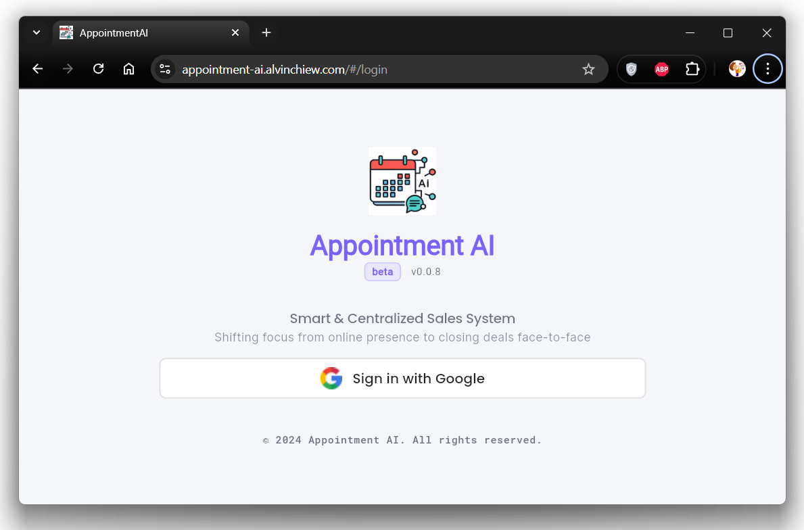

# Appointment AI

Link: [click me](https://appointment-ai.alvinchiew.com/)

## Overview

A smart & centralized system for sales leaders and agencies — automating routine tasks, enabling data-driven decisions, and shifting focus from online presence to closing deals face-to-face.

## Features

1. **AI WhatsApp Customer Engagement**
   - Product question (text, voice) and answer (text, document, audio, video)
   - Appointment Scheduling
   - Product Order Handling (Order Placement, Receipt Submission)
   - Customer / bot spam handling
   - Multiple bots setup in one account
1. **AI Leads Management**
   - Lead information, e.g. customer, chat, appointment, sales representative, etc.
   - Customer grading
   - **[FUTURE]** Customer profiling (budget, location, gender, age, etc.)
   - Export to CSV
1. **[FUTURE] Chat Management**
   - Unified WhatsApp chat between sales leader and representative for each customer
1. **Product Management**
   - Centralized product information managed by organization
   - Product team assignment for scheduled appointments
   - **[FUTURE]** AI Customer-Product matching via RAG system
1. **Member Management**
   - Organization Member for product information sharing
   - Team Member for lead assignment
1. **AI Lead Assignment**
   - Auto assignment via round robin
   - Manual assignment by sales leader
   - **[FUTURE]** Auto re-assignment of unattended appointment from sales representative
   - **[FUTURE]** AI customer-agent matching via personal attributes
1. **AI Studio**
   - Auto reply and product mapping based on ads message
   - AI personalization train ground based on product-specialized sales techniques
1. **Auto WhatsApp Blasting**
   - Anti-ban WhatsApp blasting technique integration
   - Customer lead follow up
   - **[FUTURE]** Customer appointment reminder & confirmation
   - Import leads from one product to another
1. **[FUTURE] Leads Analytics - Operation Dashboard**
   - One stop business intelligence for data driven decision making
1. **[FUTURE] Potential Additional Features**
   - AI Talk bot
   - AI Product summarizer
   - AI Instruction optimizer
   - AI self learning from sales chat histories
   - AI sales assistant to guide new agents on personalized sales technique (alternative to AI bot reply)
   - AI email handling
   - AI multi-platform handling (Facebook, TikTok, Instagram, etc.)
   - AI content creation (ads article, image, video)
   - Traditional automated WhatsApp reply SOP workflow integration for cost saving

